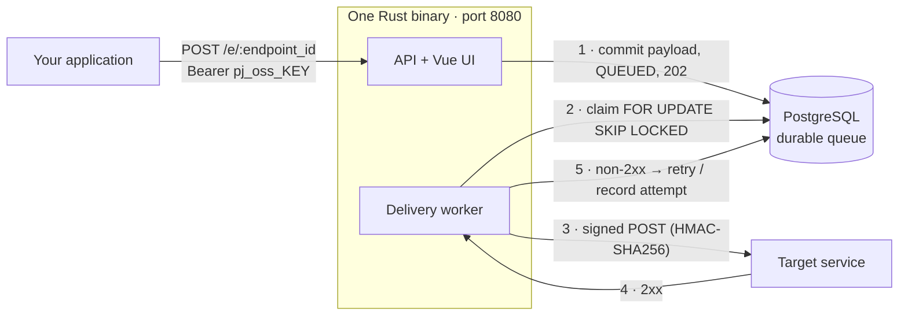
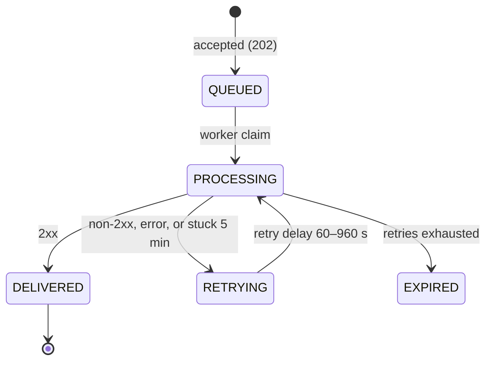

# PromptJang Webhooks OSS

Self-hosted webhook delivery in one Rust binary: API, Vue UI, and delivery worker. Durable JSON ingestion, HMAC-signed delivery, retries with attempt history, and replay. No billing, organizations, mailboxes, MCP, A2A, or hosted dependency.

## How it works





## Quickstart

```bash
cp .env.example .env   # set PJ_ADMIN_EMAIL, PJ_ADMIN_PASSWORD, PJ_POSTGRES_PASSWORD
docker compose up --build
```

Open http://localhost:8080. The first successful startup consumes the bootstrap credentials, hashes the password with Argon2id, and creates the only owner; later restarts ignore them. Migrations run automatically before the server starts, `/health` is liveness, and `/ready` checks PostgreSQL. To use external PostgreSQL (RDS, Cloud SQL, Neon, Supabase), point `DATABASE_URL` at it and inject secrets through your container platform. Do not commit `.env`.

## Send a webhook

Create an endpoint and a `pj_oss_` API key in the UI, then:

```bash
curl -X POST 'http://localhost:8080/e/ENDPOINT_ID' \
  -H 'Authorization: Bearer pj_oss_YOUR_KEY' \
  -H 'Content-Type: application/json' \
  -H 'Idempotency-Key: order-1042-created' \
  -H 'X-Event-Type: order.created' \
  -d '{"order_id":"1042"}'
```

`202` is returned only after PostgreSQL commits the payload and queued state. Reusing the same endpoint, idempotency key, and byte-identical payload returns the original event; a different payload returns `409`.

## Delivery contract

- HMAC-SHA256 over `timestamp.raw_body` in `X-PromptJang-Signature`, with `X-PromptJang-Timestamp` and `X-PromptJang-Event-ID`
- Retry delays: 60, 120, 240, 480, 960 seconds; interrupted `PROCESSING` work recovers after five minutes
- Queue claims use `FOR UPDATE SKIP LOCKED`; redirects are not followed; non-2xx retries
- Replay creates a new event and never overwrites the source
- Limits: 10 endpoints, 5 API keys, 256 KB JSON payload, 1,000 accepted events per minute per endpoint

## Development

```bash
cargo test
cd web && npm install && npm run build
```

Apache-2.0 licensed. PromptJang Cloud is not required.
